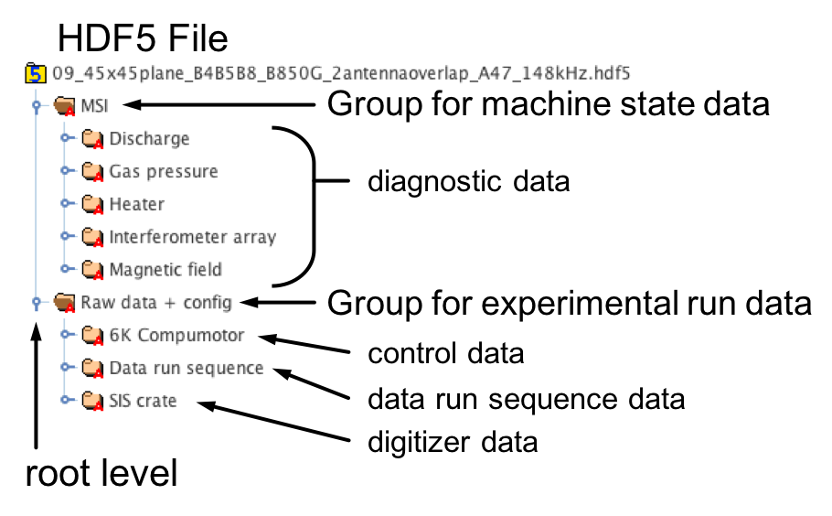

Every plasma device at BaPSF is governed by a DAQ Controller. This DAQ
Controller is tasked with operating and monitoring the plasma device,
controlling the order of operations for an experimental run, recording
data for the run, and generating the HDF5 file.

Types of Recorded Data
----------------------

Data collected by BaPSF is classified into three types:

#. :textbf:`MSI diagnostic [`:ibf:`device`:textbf:`] data`

    MSI data is machine state recordings for the plasma device the
    experiment was run on.  For example, MSI data for the LaPD would
    include diagnostics like partial gas pressure, discharge traces,
    magnetic field, etc.

#. :textbf:`Digitizer [`:ibf:`device`:textbf:`] data`

    This is "primary data" recorded by the DAQ digitizers. "Primary
    data" is any signal recorded from a plasma probe.

#. :textbf:`Control device data`

    Data recorded from a control device.  A control device is a piece
    of equipment that controls some state property of the experiments.
    For example, a probe drive records position state info for a probe
    location and a waveform generator can record driving frequencies
    of an antenna.

Internal HDF5 Structure
-----------------------

.. _fig_HDF5_structure:

   Example of a LaPD HDF5 internal data-tree.

The internal data structure (data-tree) of a HDF5 file looks very
similar to a system file structure (see :numref:`fig_HDF5_structure`),
where *groups* are akin to directories and *datasets* are akin to files.
Not depicted in :numref:`fig_HDF5_structure`, each *group* and *dataset*
can have an arbitrary number of key-value pair attributes constituting
the component's metadata.

In the above example, **MSI diagnostic data** is contain in the ``MSI``
group and the ``Raw data + config`` group houses both
**Digitizer data** and **Control device data**.  In addition to the
three typical `Types of Recorded Data`_, the ``Raw data + config``
group contains the **Data run sequence** for the experimental run.
The **Data run sequence** is the order of operations performed by the
DAQ Controller to execute the experimental run.
