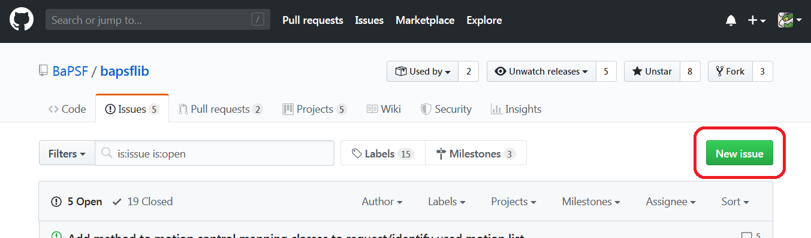

.. _contributing-to-bapsflib:

Contributing to bapsflib
========================

:mod:`bapsflib` is an open-sourced Python package developed for users of the Basic Plasma Science Facility (BaPSF) and is built upon the contributions of its users that it serves. It is dependent on user feedback to make improvements to the package and these contributions no matter how small, are integral to the development of new features and tools for the convinience of its users. 

If you have a change you would like to make, require a tool build into the package, or have an idea for improving the general user experience, feel free to suggest it by **raising it as an issue**, or perhaps  by editing the code yourself on GitHub! Your input is most welcome.

Getting Started
---------------

The first thing you'll need to get started is to have a **GitHub account**, as GitHub is the platform where all the development and collaboration takes place. You `can create an account for free <https://github.com/join?source=header-home>`_ if you do not already have one.

Next, check out the `list of issues <https://github.com/BaPSF/bapsflib/issues>`_ that are currently being discussed. You can raise your own issues if it is currently not on the list. (See tutorial below)

If you're feeling rather generous, you can help contribute code or write/edit parts of the documentation! All collaboration is done through `Git <https://git-scm.com/>`_, a version-control system that tracks changes in code during software development.  If you want to know more about it, you can read some `documentation on Git basics <https://git-scm.com/book/en/v2/Getting-Started-Git-Basics>`_ or interact with a `Git tutorial <https://try.github.io/levels/1/challenges/1>`_.  However, you do not have to know Git to edit code.  You can do all the version control with the `GitHub Desktop <https://desktop.github.com/>`_ software, although advanced users can also `install git <https://git-scm.com/book/en/v2/Getting-Started-Installing-Git>`_ and work in command line.

When coding, you may wish to look up our manual of style (to be written) to keep the code consistent with our guidelines.

Once you are done coding, you can issue a **pull request** to merge your code into the package. (See tutorial below)

Tutorial: Creating an Issue Discussion on GitHub
------------------------------------------------
Creating an issue is a very straightforward process and is typically the default option to go to if you want to raise an issue for discussion. No coding is required. This process is suitable for:

* Reporting bugs or errors
* Suggesting a new idea or features to be implemented
* Requesting help for coding or writing documentation

To raise an issue on GitHub, select the 'Issues' tab at the top of the page and click on the green 'New issue' button:

   Raising an issue on the BaPSF GitHub.

Tutorial: Creating a Pull Request on GitHub
-------------------------------------------
A pull request is slightly more complicated than raising an issue. Typically, the user has to present code edits that are proposed to be merged into the package. There are also draft pull requests where the user can present incomplete code edits and have other users comment on them. This process is suitable for:

* Making code edit suggestions
* Developing new routines to be incorporated into the package
* ...

(tutorial goes here)

Guide to developing a new module
--------------------------------
(procedure, files to edit, etc.)